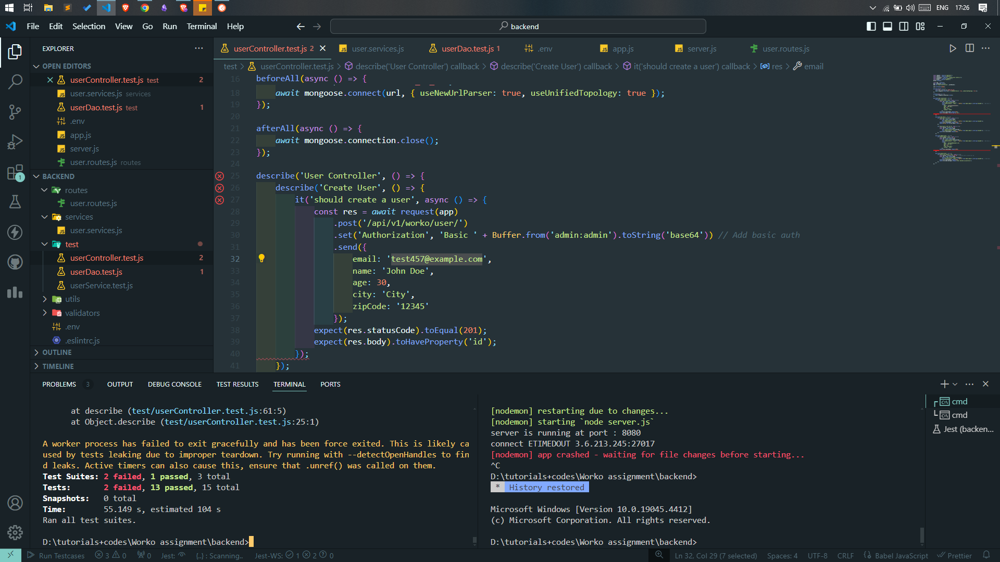

# Project Title

This is a backend assignment which inlcude RESTful APIs.This project sets up a robust Node.js backend using the MVC (Model-View-Controller) architecture, focusing on creating a scalable and maintainable API for managing user data.


## Table of Contents

- [Introduction](#introduction)
- [Features](#features)
- [Technologies Used](#technologies-used)
- [Setup Instructions](#setup-instructions)
- [Usage](#usage)
- [Testing](#testing)
- [Contributing](#contributing)
- [License](#license)

## Introduction

Node.js: Utilize Node.js for backend development.
MVC Architecture: Implement a structured approach dividing the application into Model, View, and Controller layers.
Layers:

Controller Layer: Handles incoming requests and delegates business logic to the service layer.

Service Layer: Contains business logic and interacts with the DAO layer to perform CRUD operations.

DAO Layer: Manages data access and communication with the database.

Models: Define data structures and schemas for user data, enabling CRUD operations.

DTOs: Implement Data Transfer Objects to structure request and response payloads.

Validator Framework: Validate API input for fields such as Email, Zip Code, and Id using a validator framework.

API Endpoints:

GET /worko/user: Retrieves a list of users.

GET /worko/user/:userId: Fetches details of a specific user.

POST /worko/user: Creates a new user with specified fields (Email, Name, Age, City, Zip Code).

PUT /worko/user/:userId: Updates details of an existing user.

PATCH /worko/user/:userId: Partially updates details of an existing user.

DELETE /worko/user/:userId: Soft deletes a user from the database.

User Payload:

Id: Auto-generated unique identifier.

Email: User's email address.

Name: User's full name.

Age: User's age.

City: User's city of residence.

Zip Code: User's postal code.

Environment Configuration:

Environment Variables: Store database configuration details for enhanced security and flexibility.

Unit Testing:

Test Coverage: Achieve at least 60% test coverage to ensure reliability and functionality.

## Technologies Used

- Node.JS
- JestJs
- expressJS
- supertest
- MongoDB
- dotenv
- basic-auth
- mongoose

## Setup Instructions

Ensure you have the following installed on your machine:

- Node.js - [Download & Install Node.js](https://nodejs.org/)
- clone this repository
- ```bash
    npm install
    ```
- urls : 
    1. to get user List
    ``` 
    GET METHOD - http://localhost:8080/api/v1/worko/user
    ```
    2. to create a user with data
     ``` 
    POST METHOD - http://localhost:8080/api/v1/worko/user
    ```
    3. to get user with ID 
     ``` 
    GET METHOD : http://localhost:8080/api/v1/worko/user/:id
    ```
    4. to update user data with data in body
     ``` 
    PUT METHOD : http://localhost:8080/api/v1/worko/user/:id
    ```
    5. to soft delete a data 
     ``` 
    DELETE METHOD : http://localhost:8080/api/v1/worko/user/:id
    ```
    6. to partially update user's data 
     ``` 
    PATCH METHOD : http://localhost:8080/api/v1/worko/user
    ```


    USER PAYLOAD : 

    ```
    {
        Id (Generated)
        Email
        Name
        Age
        City
        Zip code
    }


### ENVIRONMENT VARIABLES

```
MONGO_DB_URI = "mongodb+srv://worko-admin:<password>@cluster0.7fzlud3.mongodb.net/?retryWrites=true&w=majority&appName=Cluster0"

MONGO_DB_URI_TEST = "mongodb+srv://worko-admin:<password>@cluster0.7fzlud3.mongodb.net/verify?retryWrites=true&w=majority&appName=Cluster0"

PORT = 8080

NODE_ENV = 'test'

ID = '667a60e8a3ba9fe06534c11e'
DEL_ID = '667a60dda3ba9fe06534c11a'
```


### ALL SET TO GO 

Use Post Man to make request at the URL's


### NOTE TEST CASES more than 60% were successful



